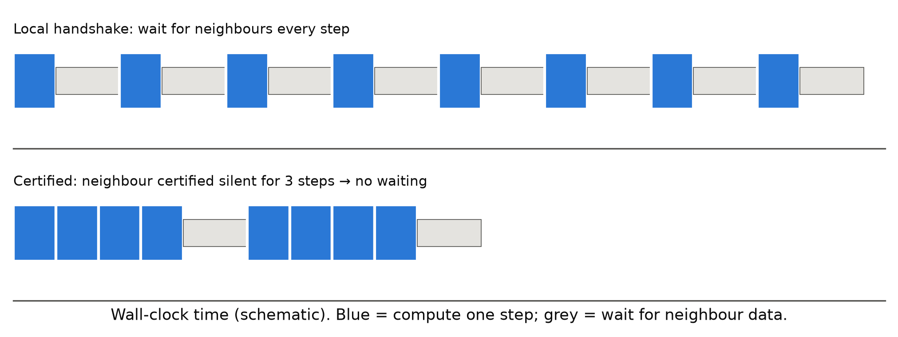
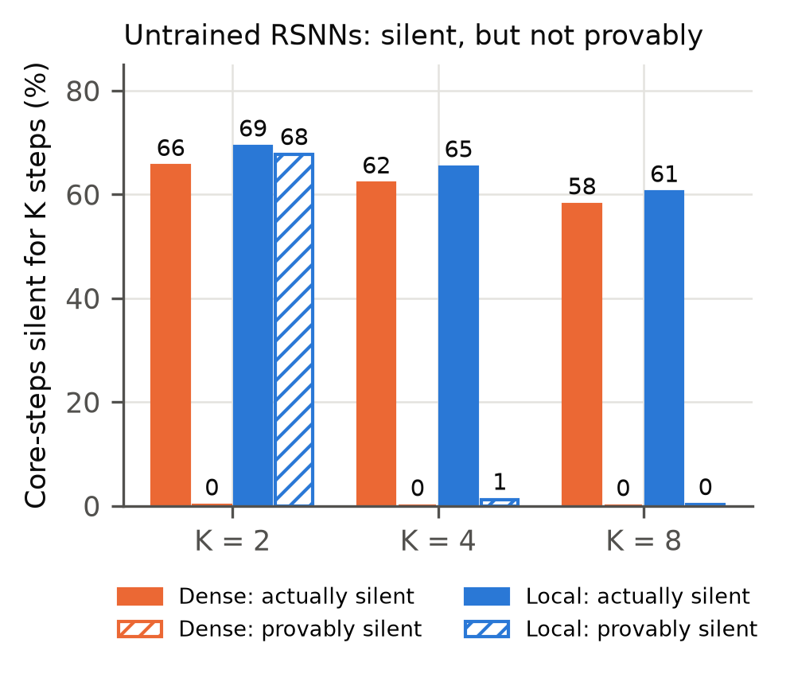
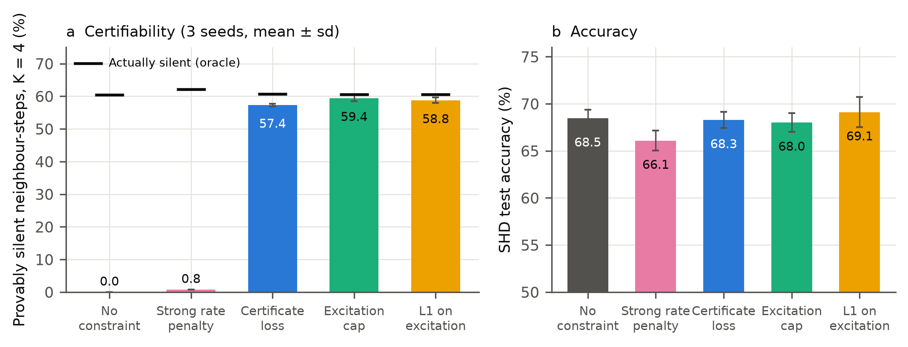
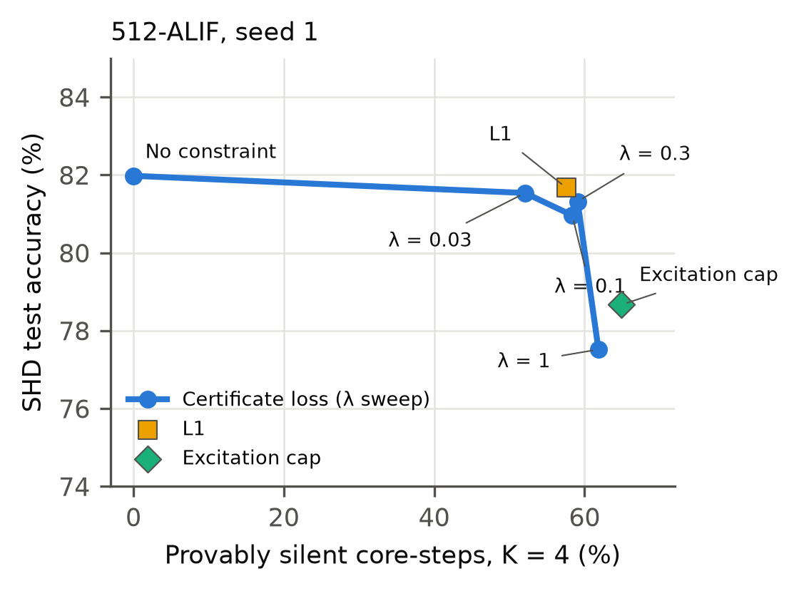
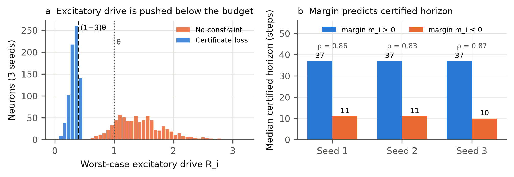
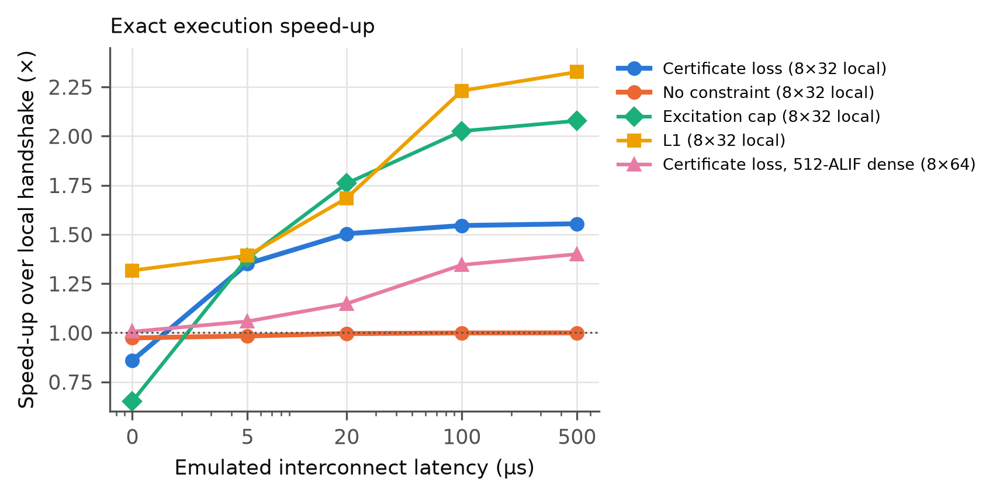

# Certifiably Silent Spiking Networks: Bounding Excitation Makes Recurrent SNN Silence Provable and Reduces Synchronization in Exact Multi-Core Execution

**Authors:** [Author name], [Affiliation], [email]

**Target journal:** [e.g., Neural Networks / Neurocomputing / IEEE TNNLS / Neuromorphic Computing and Engineering]

---

## Abstract

Neuromorphic processors run spiking neural networks (SNNs) as many small cores that must agree on each time step before advancing. As systems grow to many cores and chips, this synchronization becomes a dominant cost. Spiking activity is sparse, so it is tempting to skip synchronization for quiet parts of the network, but doing so is only safe if silence is *guaranteed*.

We show that trained recurrent SNNs are silent most of the time (about 60% of 4-step core windows) yet almost none of that silence is provable (0–1%): the worst-case excitatory recurrent drive into a typical neuron exceeds its firing threshold. We derive a simple certificate that proves a leaky integrate-and-fire neuron cannot spike over a horizon of K steps, including a recursive refinement, and show that it remains exact for adaptive thresholds and for fixed-point integer arithmetic. We identify the quantity that governs certifiability: a neuron whose worst-case excitatory drive plus external input stays below (1−β)θ can be certified silent indefinitely.

Bounding excitatory drive during training, whether through a certificate loss, an L1 penalty on excitatory recurrent weights or a hard projection, raises provable silence from 0% to 56–62% of core-steps (84–98% of the silence that actually occurs). On SHD, accuracy is unchanged within seed-to-seed variation for networks of up to 512 neurons. The cost grows to about 2 points at 1,024 neurons and is 3.7 points on SSC in short training runs. A strong firing-rate penalty produces the sparsest networks but certifies only 0.8%: sparsity is not certifiability. Certificates were never violated in any of more than 150 million certified neuron-windows checked. In an exact multi-core execution engine with locally connected cores, certificate-based synchronization runs 1.5–2.3× faster than local handshaking at 20–500 µs interconnect latency, with bit-identical spike trains. The gain shrinks to 1.15–1.40× with dense inter-core connectivity.

**Keywords:** spiking neural networks; neuromorphic computing; synchronization; certified bounds; excitatory–inhibitory balance; event-driven execution

---

## 1. Introduction

Neuromorphic processors execute spiking neural networks as many small cores that exchange spike events [1–3]. Most of these systems advance in discrete algorithmic time steps. Before a core can compute step t+1 it must know which of its presynaptic neurons spiked at step t. This is enforced either by a global barrier [2, 3] or by local handshakes between communicating cores [4]. As systems scale to many cores and chips, the cost of synchronization grows with them, and recent performance analyses identify communication and synchronization, rather than arithmetic, as frequent bottlenecks of deployed neuromorphic workloads [4–6]. Distributed SNN simulators face the same problem: NEST exchanges spikes only once per minimum synaptic delay precisely to limit communication rounds [7].

Spiking activity is sparse. In the recurrent networks studied here, a group of 32 neurons is completely silent in roughly 60% of 4-step windows. If a core *knew* that its neighbours would not spike for the next k steps, it could advance through those steps without waiting. The obstacle is that skipping synchronization is only safe with a guarantee. Observed sparsity is a statistic, and a single unexpected spike changes the computation. We show that for ordinary trained recurrent SNNs, worst-case reasoning certifies almost none of their silence. The reason is simple: the summed excitatory recurrent drive into a typical neuron exceeds its threshold, so in the worst case any neuron could fire at any step.

This paper makes silence provable and turns it into faster exact execution. Our contributions are:

1. **Silence certificates.** A worst-case bound on a leaky integrate-and-fire (LIF) neuron's membrane potential over K steps that certifies the absence of spikes (Lemma 1), and a recursive refinement that only counts presynaptic neurons that could still fire (Lemma 2). The certificates extend exactly to adaptive thresholds and to fixed-point integer arithmetic (Section 3).
2. **The excitatory-drive budget.** A neuron whose worst-case excitatory recurrent drive R_i plus external input stays below (1−β)θ can be certified silent for an unbounded horizon (Proposition 1). Empirically, the margin to this budget predicts how long a neuron can be certified (Spearman ρ = 0.83–0.87).
3. **Training for certifiability.** Any training-time bound on excitatory drive turns most natural silence into provable silence: a certificate loss, an L1 penalty on excitatory recurrent weights, or a hard projection. Provable silence rises from 0% to 56–62% of core-steps in every network we tested (256-LIF, 256/512/1024-ALIF, SHD and SSC), with zero violations. The accuracy cost is not measurable on SHD up to 512 neurons, but grows with network size (−2.1 points at 1,024) and was 3.7 points on SSC. A strong firing-rate penalty yields the sparsest networks yet certifies only 0.8% (Section 5).
4. **Exact certificate-based execution.** Cores publish short certificates ("silent through step u") that let neighbours advance without waiting. Spike trains are bit-identical to lock-step execution. In a compiled multi-core engine with locally connected cores, this runs 1.5–2.3× faster than local handshaking at 20–500 µs interconnect latency. With dense inter-core connectivity the gain falls to 1.15–1.40× (Section 5.6).

All experiments were pre-registered with explicit pass and fail criteria before they were run, and we report every outcome, including failures and invalid runs (Appendix A).

---

## 2. Related work

**Synchronization in neuromorphic systems.** TrueNorth advances all cores on a global tick [2]. Loihi exchanges barrier messages between neighbouring cores that flush in-flight spikes and propagate the time-step advance [3]. SpiNNaker runs cores against real-time timers and exchanges multicast packets [1]. NeuroScale replaces global barriers with local, neighbour-to-neighbour handshakes and removes the linear growth of synchronization cost with system size [4]. Our certificates are complementary to local handshaking: they reduce how often a handshake must actually be waited for. Analytical performance models of neuromorphic chips find that workloads are frequently bound by traffic and synchronization [5, 6].

**Sparsity and E/I structure in trained SNNs.** Firing-rate regularization is standard in SNN training [8, 9]. Yik et al. train to reduce the load on the most active core and repartition the network, achieving large speed-ups on real accelerators [5]. Training for asynchronous execution has also been studied: "unlayered backprop" trains models to tolerate the removal of layer synchronization, which changes the network's semantics [10]. These methods reduce *how much* a network fires, or adapt it to approximate execution. None provides a guarantee about *when* a part of the network will be silent, which is what exact synchronization skipping requires. Our finding that bounding excitation preserves accuracy relates to the long-standing view of cortical dynamics as inhibition-stabilized and excitation–inhibition balanced [11]. We do not claim a biological explanation.

**Certified bounds and verification for SNNs.** Interval bound propagation and linear relaxations have been adapted to SNNs to certify robustness to input perturbations [12]. Formal verification of SNNs with timed automata and probabilistic model checking [13, 14] verifies properties of fixed networks and faces state-space explosion. We use the simplest member of the bound-propagation family, but certify a different property (temporal silence under worst-case recurrent input), train networks so the property holds widely, and use it at run time.

**Skipping work in silent neurons.** "The silence of the neurons" skips the evaluation of nonlinear terms in quasi-static Izhikevich neurons [15]. It is approximate (no guarantee, small spike-timing deviations) and targets computation rather than synchronization.

**Parallel discrete-event simulation of SNNs.** Optimistic synchronization (Time Warp) lets parallel simulators run ahead and roll back on causality errors [16]. For SNNs, conservative schemes were usually faster [17]. Conservative schemes need lookahead, which SNN simulators take from the minimum synaptic delay [7, 18]. This does not help when delays are one time step, as in most trained recurrent SNNs. Our certificates provide lookahead derived from the neuron dynamics themselves, so they work at unit delay and never require rollback.

---

## 3. Method

### 3.1 Network model

We consider recurrent layers of current-based LIF neurons in discrete time. For neuron i,

> V_i[t+1] = β_i V_i[t] + I_i[t+1] + Σ_j W_ij s_j[t],
> s_i[t+1] = 𝟙[V_i[t+1] ≥ θ_i[t+1]],
> V_i[t+1] ← V_i[t+1] − θ_i[t+1] s_i[t+1],   (1)

where β_i ∈ (0,1) is the membrane decay, θ_i the threshold, I_i the external (feed-forward) input current, and W the recurrent weight matrix. For plain LIF neurons θ_i[t] = θ. For adaptive (ALIF) neurons θ_i[t] = θ + a_i[t], with a_i[t+1] = ρ_i a_i[t] + γ s_i[t] ≥ 0 [19].

External inputs for the window are known in advance: they come from a sensor buffer or an earlier layer and do not depend on the recurrent layer's future. Neurons are partitioned into cores of C neurons. A core needs the step-t spikes of every core that projects to it before it can compute step t+1.

### 3.2 Silence certificates

Define the worst-case excitatory recurrent drive of neuron i from a set S of presynaptic neurons,

> R_i(S) = Σ_{j∈S} max(W_ij, 0),   (2)

and, from the state at step t, the bound sequence

> U_i^(1) = β_i V_i[t] + I_i[t+1] + Σ_j W_ij s_j[t],
> U_i^(k) = β_i U_i^(k−1) + I_i[t+k] + R_i(S)  for k ≥ 2.   (3)

**Lemma 1 (certificate).** With S the set of all neurons, if U_i^(k) < θ for all k ≤ K, then neuron i emits no spike in (t, t+K].

*Proof.* As long as neuron i has not spiked, no reset occurs. Spikes are binary, so every recurrent input satisfies Σ_j W_ij s_j ≤ Σ_j max(W_ij, 0) = R_i. The case k = 1 is exact. Because β_i > 0 preserves order, induction gives V_i[t+k] ≤ U_i^(k) < θ ≤ θ_i[t+k] for all k ≤ K. ∎

The worst case in Lemma 1 assumes that every excitatory presynaptic neuron fires at every step. A tighter certificate only counts presynaptic neurons that could themselves still fire.

**Lemma 2 (recursive certificate).** Let S_0 be the set of all neurons and S_{n+1} = F(S_n) ∩ S_n, where F(S) = {i : ∃ k ≤ K, U_i^(k)(S) ≥ θ}. For every n, converged or not, each neuron outside S_n is silent in (t, t+K].

*Proof.* Suppose some neuron outside S_n spikes, and let i be one whose first spike in the window, at t+k, is earliest. Recurrent input at step t+m (m ≥ 2) comes from spikes at t+m−1 < t+k. By minimality, only neurons inside S_n can have spiked before t+k. Let r be the iteration at which i was removed, so S_n ⊆ S_r. Because R_i(·) is monotone in the set, V_i[t+m] ≤ U_i^(m)(S_n) ≤ U_i^(m)(S_r) for all m ≤ k. Removal at iteration r means U_i^(m)(S_r) < θ for all m ≤ K, which contradicts the spike. ∎

**Extensions.**
(i) *Adaptive thresholds:* a_i ≥ 0 implies θ_i[t] ≥ θ, so Lemmas 1–2 with the base threshold remain sound.
(ii) *Fixed-point arithmetic:* with integer state and decay v ← v − ⌊v·d/2^12⌋ (0 ≤ d < 2^12), the decay map is monotone non-decreasing, so the same induction holds exactly in integers.
(iii) *Asynchronous execution:* when a core cannot know its neighbours' next-step spikes, the exact first term in (3) is replaced by the worst case R_i. The certificate remains sound, and this is the form used at run time.

### 3.3 The excitatory-drive budget

**Proposition 1.** Suppose that over the window the external input to neuron i satisfies I_i[t+k] ≤ ā_i, and that

> m_i = (1−β_i)θ − R_i − ā_i > 0.   (4)

If V_i[t] < θ, then U_i^(k) < θ for every k: neuron i is certifiably silent for an unbounded horizon.

*Proof.* If U^(k−1) < θ, then U^(k) ≤ β_i U^(k−1) + ā_i + R_i < β_i θ + (1−β_i)θ = θ. ∎

Proposition 1 identifies the quantity that governs certifiability: the worst-case excitatory recurrent drive R_i, compared with the budget (1−β_i)θ. In our networks (1−β)θ ≈ 0.39, while untrained networks have R_i ≈ 1.4–9 (well above even θ). Short horizons (K = 4) can be certified somewhat above the budget, because the decaying factor β^k V helps. Long horizons require R_i below it (Section 5.5).

### 3.4 Training for certifiability

Any method that keeps R_i small during training makes silence certifiable. We study three.

- **Certificate loss.** Penalize the worst-case K-step reach above threshold, only at windows where the neuron is actually silent:

  > L_cert = mean_{b,t,i} 𝟙[silent in (t,t+K]] · ReLU( max_{k≤K} U_i^(k) − θ ),   (5)

  with the differentiable Lemma-1 bound (R_i = Σ_j ReLU(W_ij)). The indicator is detached, so the penalty never pushes the network to stop spiking where spikes carry information. Total loss: cross-entropy + firing-rate term + λ L_cert, with K = 4.
- **L1 on excitatory recurrent weights.** Add μ · mean_i R_i.
- **Projection (excitation cap).** After every optimizer step, rescale each neuron's positive recurrent weights so that R_i ≤ c.

We train with surrogate-gradient backpropagation through time [8, 20].

### 3.5 Certificate-based execution

Each core p runs its own loop over time steps. After computing step t it publishes its spikes and a certificate c_p: the last step through which all its neurons are provably silent (Lemma 1, asynchronous form), recomputed only when the previous certificate expires or the core spikes. Core p may compute step t+1 as soon as, for every presynaptic core q, either q's step-t spikes are available, or q's latest visible certificate covers step t, in which case q's step-t spikes are known to be zero.

**Exactness.** Certificates are only issued for steps in which a core truly does not spike (Lemma 1). Every value a core uses is therefore identical to the value it would receive under lock-step execution, so spike trains are bit-identical. We verify this on every run.

---

## 4. Experimental setup

**Datasets.**
- *Spiking Heidelberg Digits (SHD):* 20 classes, 8,156 training and 2,264 test samples, 700 input channels [21]. Spikes are binned into T = 100 steps over 1.4 s.
- *Spiking Speech Commands (SSC):* 35 classes, 75,466 training and 20,382 test samples [21]. Binned into 100 steps over 1 s.

**Models.**
- *Small:* one recurrent layer of 256 LIF neurons (β = e^{−0.5}, θ = 1, reset by subtraction), partitioned into 8 cores × 32 neurons with ring-local recurrence (each core connects to itself and its two neighbours, mimicking core-local mappings). Adam, lr 10^{−3}, 15 epochs, batch 128, firing-rate penalty ReLU(r − 0.05).
- *Strong:* one recurrent layer of 512 ALIF neurons (ρ = e^{−14/200}, γ = 0.02) with dense recurrence; 16 cores × 32 for metrics. AdamW, lr 2·10^{−3}, cosine schedule, 40 epochs, time-shift and channel-jitter augmentation.
- *Strong-heterogeneous (S2b):* 1024 ALIF neurons with learnable per-neuron β_i and ρ_i, 60 epochs.

**Certification metrics.** For K-step windows starting at every step of 500 test samples:
- the fraction of *neighbour-steps* (small model: both neighbouring cores provably silent) or *core-steps* (dense models: all neurons of the core provably silent) certified by Lemma 2;
- the same fraction computed from the actual spike trains (*oracle*), which is the upper bound;
- *violations:* certified windows in which a spike actually occurred. Must be zero.

**Execution engine.** C++ (std::thread), one thread per core, atomics for publishing spikes and certificates. Interconnect latency L is emulated by making published data visible to other cores only L µs after publication. L ∈ {0, 5, 20, 100, 500} µs, spanning InfiniBand (≈1–7 µs), Ethernet MPI (≈30 µs) and slower links [22]. Each configuration runs 200 test samples. The median per-sample wall-clock time is reported, and spike trains are compared bit-for-bit with a single-thread reference. Baseline: *local handshake*, in which each core waits for its presynaptic cores every step (the NeuroScale protocol [4]). Hardware: Intel i7-10750H (6 cores, 12 threads), NVIDIA RTX 2060 (training), Ubuntu 24.04 under WSL2.

**Pre-registration.** Every experiment's hypothesis, configuration and pass/fail criterion was written into a dated log before running. Deviations and invalid runs are listed in Appendix A.

---

## 5. Results

### 5.1 Trained SNNs are silent but not provably silent

Figure 2 shows provable versus actual silence in untrained-for-certification networks.
- In the dense network, cores are actually silent in 62% of 4-step windows, but provably silent in **0.0%**.
- In the ring-local network, the recursive certificate is nearly tight for K = 2 (68% provable vs 69% actual), but collapses beyond (**1%** at K = 4, **0%** at K = 8). Worst-case recurrent input compounds with every step.
- The cause is visible in the excitatory drive. Untrained networks have mean R_i ≈ 1.44 (small) and 4.8–9.2 (strong), well above θ = 1 (Figure 5a).

*Figure 1. Certificate-based execution (schematic). Top: with local handshaking a core waits for its neighbours' data every step. Bottom: a neighbour certified silent for several steps lets the core advance without waiting; results are bit-identical.*

*Figure 2. Untrained recurrent SNNs (SHD, seed 0) are mostly silent but almost never provably silent beyond two steps. Solid bars: fraction of core-steps actually silent for K steps. Hatched: fraction certified by Lemma 2.*

### 5.2 Bounding excitation makes silence provable; sparsity does not

Table 1 and Figure 3 compare five training regimes on the small model over three seeds.

**Table 1.** Small model (256 LIF, 8×32 ring-local, SHD), mean ± s.d. over 3 seeds. Certified = provably silent neighbour-steps, K = 4.

| Training | Accuracy (%) | Certified (%) | Actually silent (%) | Firing rate (%) |
|---|---|---|---|---|
| No constraint | 68.5 ± 1.1 | 0.0 ± 0.0 | 60.4 | 2.4–2.9 |
| Strong rate penalty | 66.1 ± 1.3 | 0.8 ± 0.0 | 62.1 | **1.3–1.8** |
| Certificate loss (λ = 0.1) | 68.3 ± 1.1 | 57.4 ± 0.5 | 60.7 | 2.2–2.7 |
| Excitation cap (R ≤ 0.33) | 68.0 ± 1.2 | **59.4 ± 1.2** | 60.5 | 2.1–2.4 |
| L1 on excitation (μ = 0.1) | **69.1 ± 2.0** | 58.8 ± 1.1 | 60.6 | 2.3–2.6 |

- All three excitation-bounding methods certify 95–98% of the silence that actually occurs, with no measurable accuracy cost at this scale.
- The strong firing-rate penalty produces the *sparsest* networks yet certifies only 0.8%: its excitatory drive stays above threshold (R_i ≈ 1.3).
- **Sparsity and certifiability are different properties.** Only bounding excitation yields guarantees.
- In every bounded-excitation model the recurrence remains functionally important: zeroing the recurrent weights costs 11–17 accuracy points. These networks are inhibition-dominated, not feed-forward.

*Figure 3. (a) Provably silent neighbour-steps (K = 4) for five training regimes, mean ± s.d. over 3 seeds; black marks show actual silence. (b) Test accuracy.*

### 5.3 Results hold for stronger models

Table 2 reports the dense 512-ALIF network over three seeds and the 1024-ALIF heterogeneous network.

**Table 2.** Stronger models (SHD). Core-certified = provably silent core-steps, K = 4.

| Model | Training | Accuracy (%) | Core-certified (%) | Actually silent (%) | Violations |
|---|---|---|---|---|---|
| 512-ALIF dense, 3 seeds | none | 80.7 ± 1.3 | 0.0 | — | 0 |
| | certificate loss λ = 0.3 | 79.9 ± 2.6 | 60.2 ± 1.0 | 62.9 | 0 |
| | *paired difference* | **−0.79 ± 3.07** | | | |
| 1024-ALIF dense, 3 seeds | none | 83.3 ± 1.7 | 0.0 | — | 0 |
| | certificate loss λ = 0.3 | 81.2 ± 0.1 | 60.7 ± 1.2 | 63.6 | 0 |
| | *paired difference* | **−2.11 ± 1.68** | | | |
| 1024-ALIF heterogeneous, seed 1 | none | 83.9 | 0.0 | 56.0 | 0 |
| | certificate loss λ = 0.3 | 83.2 | 57.4 | 61.4 | 0 |

- The paired accuracy difference across seeds (−0.66, −3.93, +2.21 points) is smaller than the seed-to-seed spread. The cost is not distinguishable from zero with three seeds.
- The dense network depends heavily on its recurrence: zeroing recurrent weights drops accuracy to 11–19%.

**Network size.** With the same 512-ALIF recipe at H = 256 and H = 1024 (seed 1), certification is essentially constant: 60.0% and 60.5% of core-steps, 93% and 95% of the silence that actually occurs, with zero violations. The accuracy cost, however, grows with size: −0.7 points at H = 256 (one seed), −0.79 ± 3.07 at H = 512 (three seeds), and **−2.11 ± 1.68 at H = 1024 (three seeds)**. At H = 1024 the certified networks plateau near 81% (81.4, 81.1, 81.2%) while controls reach 81.4–84.4%. This fails our pre-registered cost bar (≤ 1.5 points). We hypothesize that the per-neuron budget (1−β)θ, which does not depend on fan-in, becomes relatively more restrictive as networks grow. Fan-in-aware budgets are a natural next step.

**Second dataset (SSC).** On Spiking Speech Commands (35 classes, 15 training epochs because of compute limits), the unconstrained network is actually silent in 66.8% of core-steps but provably silent in 0.4%. The certificate loss (λ = 0.3) certifies 60.7% (84% of the silence that actually occurs) with zero violations, at an accuracy cost of 3.7 points (61.6% → 57.9%). This misses our pre-registered cost bar of 2 points. L1 enforcement gives a similar picture: 56.4% certified (84% of oracle), zero violations, and a cost of 3.0 points (58.5%), also above the bar. All models are under-trained at 15 epochs, and we do not know whether the gap would close with longer training. On this harder 35-class task, the cost of bounding excitation is 3–4 points whichever method enforces it.

### 5.4 The accuracy–certification trade-off

Figure 4 shows the trade-off on the 512-ALIF network (seed 1):
- The certificate loss gives a smooth dial: λ = 0.03 certifies 52% (85% of oracle) at −0.4 points; λ = 0.3 certifies 59% at −0.7; λ = 1 certifies 62% at −4.5.
- L1 certifies 58% at −0.3 points.
- The excitation cap certifies the most (65%), at −3.3 points, with a lower firing rate (2.0%).

Given seed noise of about ±3 points, the accuracy differences among these methods are not conclusive. All reach similar certification at similar cost.

*Figure 4. Accuracy versus provable silence on the 512-ALIF network (seed 1) for the certificate loss (λ sweep), L1 and the excitation cap.*

### 5.5 The excitatory-drive budget explains certified horizons

Certifiably trained networks concentrate R_i just below the budget (1−β)θ ≈ 0.39 (mean 0.33; Figure 5a). The same happens on the strong models (0.32–0.33), and in the heterogeneous model with per-neuron budgets (mean R_i 0.33 against a mean budget of 0.31).

Proposition 1 predicts that neurons with positive margin m_i (Eq. 4, with ā_i set to the 90th percentile of the neuron's external input) are certifiable for much longer.
- Across three seeds, positive-margin neurons are certified for a median of **37 steps**, against 10–11 steps for the others (Figure 5b).
- The margin rank-correlates with the mean certified horizon at ρ = 0.83–0.87.
- Our pre-registered prediction was a ratio of at least 4×. The observed ratio is 3.4–3.7×: supported in direction and strength, short of the predicted magnitude. Horizons are also capped by the end of each 100-step sample (median remaining ≈ 50 steps), which compresses the ratio.

*Figure 5. (a) Distribution of worst-case excitatory drive R_i (3 seeds) without and with certified training; dashed line: budget (1−β)θ; dotted: θ. (b) Median certified horizon for neurons with positive vs non-positive margin; ρ: Spearman correlation between margin and mean certified horizon.*

### 5.6 Exact certificate-based execution

Figure 6 and Table 3 report wall-clock speed-up over local handshaking in the multi-core engine. Every run produced spike trains bit-identical to the reference.

**Table 3.** Speed-up over local handshake (median over 200 SHD samples).

| Model | Cores | Coverage | L = 5 µs | 20 µs | 100 µs | 500 µs |
|---|---|---|---|---|---|---|
| No constraint (small) | 8×32 local | 0.2% | 0.98× | 1.00× | 1.00× | 1.00× |
| Certificate loss (small) | 8×32 local | 67.4% | 1.35× | 1.50× | 1.55× | 1.55× |
| Excitation cap (small) | 8×32 local | 67.4% | 1.38× | 1.76× | 2.03× | 2.08× |
| L1 (small) | 8×32 local | 70.3% | 1.39× | 1.68× | 2.23× | 2.33× |
| Certificate loss (512-ALIF) | 8×64 dense | 61.4% | 1.06× | 1.15× | 1.34× | 1.40× |

- **No training, no speed-up.** Untrained networks are essentially never certifiable when a core cannot know its neighbours' next spikes (coverage 0.2%), so they gain nothing. The entire speed-up comes from bounded excitation.
- **Overhead at very low latency.** At L = 0, certificate computation can cost more than it saves (0.65–0.86× for two of the models).
- **Dense connectivity limits the gain.** With all-to-all inter-core connectivity a core must hear from every other core, and a wait is removed only when all of them are certified simultaneously, so the speed-up shrinks to 1.15–1.40×.
- **Where it pays.** The benefit is largest for locally connected cores and for latencies typical of multi-board systems and clusters (≥ 20 µs). On a single chip, where synchronization takes under a microsecond [3], little gain should be expected.

*Figure 6. Speed-up of certificate-based execution over local handshaking versus emulated interconnect latency. All runs are bit-exact.*

### 5.7 Certificates are exact under chip-style fixed-point arithmetic

We quantized the three small certified models to 8-bit integer weights, integer membrane state and a Loihi-style integer decay (v ← v − ⌊v·1612/4096⌋), and simulated them in exact integer arithmetic.
- Integer accuracy was 68.8 / 67.8 / 68.2% (float: 69.4 / 67.3 / 68.2%).
- 57.6–58.5% of neighbour-steps were certified (oracle 61.0–62.0%).
- **Zero violations occurred across 158,571,183 certified neuron-windows**, as predicted by the monotone-decay argument (Section 3.2, extension ii).

---

## 6. Discussion

**What the results establish.** Provable silence in recurrent SNNs is governed by one quantity: worst-case excitatory recurrent drive relative to the budget (1−β)θ. Training methods that bound this quantity, whether a dedicated certificate loss or a one-line L1 penalty or projection, make most natural silence provable in every network we tested. The accuracy cost is not measurable for networks of up to 512 neurons on SHD, but reaches about 2 points at 1,024 neurons and 3.7 points on SSC in short training runs. Firing-rate regularization, the standard sparsity tool, does not. The resulting certificates are exact, extend to adaptive thresholds and integer arithmetic, and can replace waiting in multi-core execution without changing a single spike.

**Why bounded excitation costs little accuracy.** Bounded-excitation networks keep large inhibitory recurrence (total |W_rec| per neuron ≈ 2.0–2.2 against R_i ≈ 0.04–0.33), and removing recurrence still costs 11–17 points. Computation seems to move into inhibition-dominated recurrent dynamics. This is reminiscent of inhibition-stabilized cortical circuits [11], but we make no biological claim.

**When to use it.** The execution benefit is largest when inter-core connectivity is local and communication latency is high relative to per-step compute: multi-chip and multi-board neuromorphic systems, and distributed SNN simulation on clusters. With dense inter-core connectivity, or at very low latency, the benefit is small or negative. Certificate coverage (the fraction of core-steps certified) is a cheap, hardware-independent predictor of benefit and can be measured before deployment.

**Limitations.**
1. Speed was measured in an emulated multi-core engine on a CPU, not on neuromorphic hardware. Latency is emulated, and absolute times include CPU effects.
2. Our strongest model reaches 83.9% on SHD, below state-of-the-art architectures (≈95–96%) that use learned delays, multiple layers or state-space formulations [23, 24]. Extending certificates to synaptic delays and multi-layer networks is straightforward in principle (delays add exact lookahead; deeper layers add presynaptic cores) but untested.
3. Speed-ups are moderate (1.5–2.3×) and shrink with dense connectivity.
4. Several results rest on a single seed (trade-off curve, S2b, SSC, engine runs), and accuracy differences between enforcement methods are within seed noise. On SSC (trained for only 15 epochs) and at H = 1024, certification cost 2.9–3.7 accuracy points in single-seed runs, so the claim of "no measurable cost" holds for SHD at H ≤ 512 and must be qualified elsewhere.
5. Our novelty assessment rests on a targeted literature search. We are not aware of prior work that trains SNNs for provable silence, but cannot exclude it.

**Future work.** A direct test on multi-chip neuromorphic hardware (e.g., SpiNNaker2 or Loihi 2); certificates with learned synaptic delays and multiple layers; energy measurements; and joint optimization of core mapping and excitation budgets.

---

## 7. Conclusion

Spiking networks are mostly silent, but that silence is only useful for skipping synchronization if it can be proven. We showed that provability is governed by a single, trainable quantity, the worst-case excitatory recurrent drive, and that bounding it makes most natural silence provable in every network we tested. The cost is negligible for moderate-size networks and 2–4 accuracy points for larger networks and harder tasks. Sparsity alone does not achieve this. The resulting certificates are exact under adaptive thresholds and fixed-point arithmetic, and they enable bit-exact execution that is 1.5–2.3× faster than local handshaking on locally connected multi-core systems at realistic interconnect latencies.

---

## Data and code availability

All code (training, certificate checking, fixed-point simulation, C++ execution engines, figure generation) and the full pre-registration log will be released at [repository URL] upon publication.

## Use of AI tools

[State the use of AI assistance according to the target journal's policy.]

## Appendix A. Pre-registration log (summary)

Every experiment below was registered with its criterion before running. Outcomes are reported as they occurred.

| ID | Question | Outcome |
|---|---|---|
| PILOT-003 | Provable silence in dense untrained RSNN | Inconclusive; not viable (≈ 0% at core level) |
| PILOT-003b | Same, ring-local | Inconclusive; K = 2 nearly tight, K = 4 = 0% |
| PILOT-004 | Certificate loss raises provable silence | Viable (0 → 56%); integrity checks passed |
| PILOT-005 | Replication, 3 seeds | Passed |
| PILOT-006 | Idealized message count vs lock-step | Inconclusive (control criterion failed: an idealized protocol with exact next-step knowledge gives untrained nets 1.5×) |
| PILOT-007 | Sparser-activity regime | Stop rule triggered; manipulation check failed (rates did not drop) |
| S1 | Python multi-process engine | Inconclusive; certificate overhead dominated |
| S1b | C++ engine, O(1) certificate | Failed; certificate coverage 0.2% (design error) |
| S1c | C++ engine, Lemma-1 certificate | Passed (1.50–1.55×) |
| S2 / S2-rep | 512-ALIF, 3 seeds | Partial (control < 85%); method criteria passed |
| ALT-001 | Simpler alternatives | Scenario (b): L1 and projection match the certificate loss; rate penalty fails |
| FXP-001 | Fixed-point soundness | Passed (0 / 158.6 M) |
| HORIZON-001 | Margin predicts horizon | Partially supported (3.4–3.7× vs predicted ≥ 4×) |
| ENGINE-ALT | Speed for L1 / projection | Passed (1.68–2.33× at L ≥ 20 µs) |
| ENGINE-002 | Dense engine, 16 cores | Invalid (thread over-subscription) |
| ENGINE-002b | Dense engine, 8 cores | Failed bar (1.15–1.40×) |
| S2b | 1024-ALIF heterogeneous | Partial (control 83.9% < 85%); method criteria passed |
| SCALE-001 | Network size 256 / 1024 | Partial: certification met at all sizes; cost bar missed at 1024 (−2.9, one seed) |
| SCALE-rep | 1024, seeds 2–3 | Failed cost bar: −2.11 ± 1.68 (3 seeds); certification steady (≈ 60%, 0 violations) |
| SSC-001 | Second dataset | Partial: certification met (84% of oracle, 0 violations); cost bar failed (−3.7 vs ≤ 2.0) |
| SSC-L1 | SSC with L1 enforcement | Partial: certification met (84% of oracle, 0 violations); cost bar failed (−3.0) |

A data-handling error occurred: the seed-1 result files of PILOT-005 were overwritten by PILOT-007. Seed-1 values were taken from the pre-registered run logs.

---

## References

[1] S. B. Furber, F. Galluppi, S. Temple, L. A. Plana. The SpiNNaker project. *Proceedings of the IEEE* 102(5), 652–665 (2014).
[2] P. A. Merolla et al. A million spiking-neuron integrated circuit with a scalable communication network and interface. *Science* 345, 668–673 (2014).
[3] M. Davies et al. Loihi: a neuromorphic manycore processor with on-chip learning. *IEEE Micro* 38(1), 82–99 (2018).
[4] C. Li, N. Imam, R. Manohar. A deterministic neuromorphic architecture with scalable time synchronization. *Nature Communications* 16, 10329 (2025).
[5] J. Yik et al. Modeling and optimizing performance bottlenecks for neuromorphic accelerators. arXiv:2511.21549 (2025).
[6] J. Timcheck, A. Pierro, S. B. Shrestha. A compute and communication runtime model for Loihi 2. arXiv:2601.10035 (2026).
[7] J. Hahne et al. Efficient communication in distributed simulations of spiking neuronal networks with gap junctions. *Frontiers in Neuroinformatics* 14:12 (2020).
[8] F. Zenke, T. P. Vogels. The remarkable robustness of surrogate gradient learning for instilling complex function in spiking neural networks. *Neural Computation* 33(4), 899–925 (2021).
[9] N. Perez-Nieves, V. C. H. Leung, P. L. Dragotti, D. F. M. Goodman. Neural heterogeneity promotes robust learning. *Nature Communications* 12, 5791 (2021).
[10] R. Koopman, A. Yousefzadeh, M. Shahsavari, G. Tang, M. Sifalakis. Exploring the limitations of layer synchronization in spiking neural networks. *Transactions on Machine Learning Research* (2025).
[11] [Citation for inhibition-stabilized networks / E–I balance — to be verified, e.g., Tsodyks et al. 1997; van Vreeswijk & Sompolinsky 1996.]
[12] Toward robust spiking neural network against adversarial perturbation (S-IBP / S-CROWN). arXiv:2205.01625 (2022). [authors to be verified]
[13] E. De Maria et al. [timed-automata modelling of LIF networks — to be verified].
[14] Probabilistic modeling of spiking neural networks with contract-based verification. arXiv:2506.13340 (2025). [authors to be verified]
[15] M. Heidarpur, A. Ahmadi, M. Ahmadi. The silence of the neurons: an application to enhance performance and energy efficiency. *Frontiers in Neuroscience* (2024).
[16] D. R. Jefferson. Virtual time. *ACM Transactions on Programming Languages and Systems* 7(3), 404–425 (1985).
[17] Performance evaluation of spintronic-based spiking neural networks using parallel discrete-event simulation. *ACM TOMACS* (2024), doi:10.1145/3649464. [authors to be verified]
[18] N. Ahmad, J. B. Isbister, T. S. C. Smithe, S. M. Stringer. Spike: a GPU optimised spiking neural network simulator. bioRxiv 461160 (2018).
[19] G. Bellec, D. Salaj, A. Subramoney, R. Legenstein, W. Maass. Long short-term memory and learning-to-learn in networks of spiking neurons. *NeurIPS* (2018).
[20] E. O. Neftci, H. Mostafa, F. Zenke. Surrogate gradient learning in spiking neural networks. *IEEE Signal Processing Magazine* 36(6), 51–63 (2019).
[21] B. Cramer, Y. Stradmann, J. Schemmel, F. Zenke. The Heidelberg spiking data sets for the systematic evaluation of spiking neural networks. *IEEE Transactions on Neural Networks and Learning Systems* 33(7), 2744–2757 (2022).
[22] J. Liu, J. Wu, D. K. Panda. High performance RDMA-based MPI implementation over InfiniBand. *International Journal of Parallel Programming* (2004) / ICS 2003. [verify exact venue]
[23] M. Baronig et al. Advancing spatio-temporal processing through adaptation in spiking neural networks. *Nature Communications* (2025). [verify volume/article]
[24] I. Hammouamri, I. Khalfaoui-Hassani, T. Masquelier. Learning delays in spiking neural networks using dilated convolutions with learnable spacings. *ICLR* (2024).
